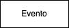
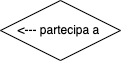

# Schema concettuale (modello E-R)

A questo punto possiamo passare dagli appunti ad una raffigurazione grafica un po' più strutturata, per ragionare meglio sul progetto da realizzare.

Lo schema che andremo a creare si chiama **schema concettuale**. In questa fare siamo ancora in una descrizione ad alto livello, non dobbiamo soffermarci o preoccuparci degli aspetti tecnici.

Lo schema concettuale rappresenta la struttura del progetto, non si occupa delle singole _istanze_ (ovvero del singolo dipendente, prenotazione, etc.)

> Esistono molte convenzioni per i diagrammi E-R. Noi ne seguiremo le stesse convenzioni del corso di Base di Dati della Sapienza (prof.ssa Tiziana Catarci, prof. Francesco Leotta). Le slide sono disponibili online.

## Entità
Le entità rappresentano concetti all'interno del nostro dominio. Tipicamente, i nomi che abbiamo individuato nella fase di analisi dei requisiti diventano entità.

Le entità:
- si rappresentano attraverso dei rettangoli
- hanno il nome al singolare
- generalmente iniziano con le lettere maiuscole

## Relazioni
Le relazioni tra entità si rappresentano tramite rombi con all'interno un verbo.

All'interno del rombo ci deve essere anche una freccia che indica la direzione in cui si legge il verbo. Si devono mettere inoltre le _molteplicità_ nel punto in cui la linea della relazione tocca l'entità.

La molteplicità indica quante volte una certa istanza può essere coinvolta nella relazione, e si indica con una coppia di numeri tra parentesi separati da virgola, ad esempio `(0,1)` oppure `(1,n)`. Se i due numeri coincidono, si può scrivere una volta sola, ad esempio `(1)` equivale a `(1,1)`. I due numeri in questione si chiamano __cardinalità__, ed in particolare il primo numero è la cardinalità _minima_ ed il secondo numero la cardinalità _massima_.

Alcune osservazioni
- se la cardinalità minima è 0, vuol dire che la relazione è opzionale
- se la cardinalità minima è 1 (o più), vuol dire che la relazione è obbligatoria
- se la cardinalità massima è un numero esatto, vuol dire che la relazione può avere al massimo quel numero di istanze
- se cardinalità massima è `n`, vuol dire che la relazione può avere un numero indeterminato di istanze

Ad esempio:

Le molteplicità si leggono partendo dalla relazione opposta e passando per la relazione. Di seguito alcuni esempi.

Relazione "partecipa a", molteplicità lato evento (0,n):
- possono esistere utenti che non partecipano a nessun evento
- un utente può partecipare a più eventi 

Relazione "partecipa a", molteplicità lato utente (0,n):
- possono esistere eventi senza partecipanti
- un evento può avere più partecipanti

Relazione "organizza", molteplicità lato utente (1):
- un evento deve avere un organizzatore
- un evento è organizzato da esattamente un utente

Relazione "organizza", molteplicità lato evento (0,n):
- possono esistere utenti che non organizzano nessun evento
- un utente può organizzare più eventi

> Le relazioni possono collegare anche più di due entità; in questo caso però la situazione diventa un po' più complicata da leggere e gestire. In generale, se possibile meglio evitare.

Alcune relazioni hanno molteplicità più complesse; in questo caso si aggiungono delle note sotto il diagramma per specificarle in modo discorsivo.

## Attributi
Sia le entità che le relazioni possono avere attributi. Gli attributi li rappresentiamo con un bastoncino che termina con una pallina:
- se la pallina è nera, l'attributo è una chiave primaria
- se la pallina è bianca, è un normale attributo

Altre convenzioni da tenere a mente:
- se non c'è una chiave primaria naturale (es. codice fiscale), usiamo una chiave surrogata che possiamo chiamare semplicemente `id`
- non è necessario mettere come attributi le chiavi esterne, perché quelle sono già incluse all'interno delle relazioni.

### Attributi calcolati
Alcuni valore possono essere calcolati automaticamente da altri attributi. Ad esempio, per l'entità utente potremmo avere bisogno sia della data di nascita che dell'età. In generale, conviene mettere solo un attributo, e specificare nelle note sotto al diagramma che il valore di età verrà calcolato. 

In alcuni casi però può convenire mantenere un attributo calcolato, se questo ha dei vantaggi computazionali. Ad esempio immaginiamo un blog in cui devo visualizzare la lista di tutti i post e per ognuno il numero di like. Ogni post potrebbe venire visualizzato migliaia di volte al giorno, e potrebbe avere migliaia di like. In teoria, il numero di like è un valore calcolato come numero di istanze della relazione post ed utente, ma probabilmente conviene salvarlo come attributo ridondato, per evitare di calcolarlo ogni volta. Il problema è ovviamente che ad ogni nuovo like devo ricordarmi di aggiornare il valore dell'attributo.

## Scelta tra entità, relazione e attributo
A volta può sorgere il dubbio se "qualcosa" sia meglio rappresentarlo come entità e relazione. Immaginiamo ad esempio un utente che prenota un'acconciatura dal parrucchiere. Il concetto di "prenotazione" è un entità a sé stante o una relazione tra utente ed acconciatura?

Altre volte può sorgere il dubbio se qualcosa è un'entità indipendente o solo un attributo. Ad esempio, la città dove vive l'utente, posso rappresentarla solo come un attributo o deve essere un'entità separata?

Non c'è una risposta corretta ed una sbagliata, ma possiamo tenere in mente le seguenti cose:
- se qualcosa ha un significato indipendente dal resto del modello, allora probabilmente è un'entità
- se qualcosa ha senso solo in relazione ad altre entità, allora probabilmente è una relazione
- come regola a spanne, se una relazione comincia ad avere molti attributi, probabilmente dovrebbe essere un'entità
- se un attributo è dipendente dagli altri attributi, allora potrebbe essere utile fare un'entità separata (es. città e regione sono dipendenti tra loro)

