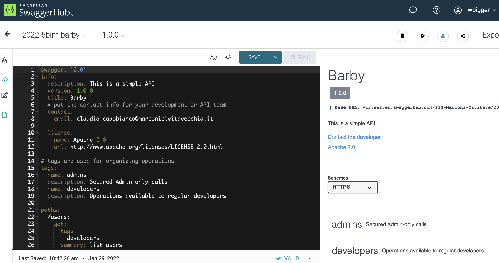

# Tools

Per definire e testare le REST API, ci sono diversi strumenti molto utili, di seguito ne descriviamo un paio.

## Postman
[Postman](https://www.postman.com/) è una piattaforma pensata principalmente per il test di un server già esistente. Fornisce moltissimi strumenti per automatizzare i test, dando la possibilità di creare anche scenari complessi con diversi variabili ambientali. 

Fornisce anche la possibilità di creare automaticamente la documentazione, oppure di fare il design di nuove API. 

Si interfaccia in modo molto fluido con Swagger: è possibile importare facilmente o addirittura sincronizzare nel tempo un progetto Swagger dentro Postman.

## Swagger
[Swagger](https://swagger.io/) è pensato principalmente per fare il design delle REST API. Attraverso un file in formato `.yaml`, è possibile descrivere accuratamente come dovrà funzionare il nostro server, ancora prima di averlo creato.

Swagger da la possibilità di creare un server di mockup che genera le risposte alle chiamate HTTP esattamente come sono state definite.

Anche Swagger ha una funzionalità che si chiama [Inspector](https://swagger.io/tools/swagger-inspector/) che permette di fare il test delle API su un server esistente. In questo caso, è richiesto che all'interno del server da testare sia presente un file `swagger.json` con la definizione delle chiamate fornite dal server stesso. 