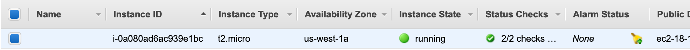
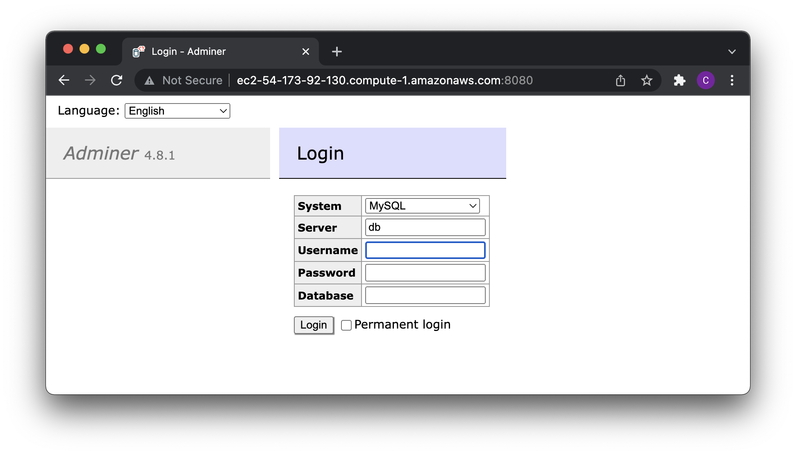

# Cloud tutorial

Per il tutorial useremo AWS Academy che non richiede una carta di credito per fare l'account. Dovrete usare il vostro indirizzo email della scuola

## Login

Andare su [AWS Academy](https://www.awsacademy.com/SiteLogin) e fare il login. 

Tra i corsi disponibili, andare su "AWS Academy Learner Lab", quindi su Moduli -> Learner Lab Foundational Services -> Start Lab.

Aspettare qualche secondo che il pallino vicino ad AWS da rosso diventi verde, quindi cliccarci sopra.

Importante: ricordarsi sempre di chiudere la sessione del laboratorio quando si ha finito con gli esercizi, per non sprecare credito. Si consiglia anche di interromprere tutti i servizi (EC2, database, etc), perché non tutti vengono chiusi automaticamente.

Ricordatevi di rimanere sempre in Virginia Settentrionale, altrimenti il vostro credito _non_ funzionerà.

## Creare un'istanza
Ora vi ritrovate in una console reale di AWS!

Dalla lista dei servizi in alto, selezionate EC2. Nella pagina che si apre, selezionate il bottone arancione per lanciare una nuova istanza. Lasciate tutto di default: Linux Amazon 2 AMI su x86 a 64bit, e t2.micro.

Alla fine del processo, quando richiesto, usare la chiave vockey.pem. La chiave può essere scaricata in qualsiasi momento dal sito di AWS Academy andando su "AWS Details", vicino al bottone "Start Lab" che abbiamo premuto prima. Si consiglia di rinominare subito la chiave appena scaricata in `vockey.pem`, per semplificare le operazioni successive.

Non chiudere la finestra della dashboard, ci servirà in seguito.

**CHECKPOINT**
Controllare sulla dashboard che l'istanza sia "running".

<p class="centered img-container">

</p>


## Accedere all'istanza da terminale
Dal vostro computer, aprite il vostro terminale preferito, navigate nella cartella in cui si trova la chiave scaricata.

Dalla console di AWS, selezionate l'istanza a cui volete connettervi, quindi andate in alto cliccate su "Connect". Selezionate la tab "SSH client". Solo la prima volta che avete scaricato la chiave, selezionate il comando al punto 3 `chmod...` per cambiare i permessi della chiave. Quindi selezionate il comando nell'esempio `ssh -i...` ed incollatelo nel vostro terminale.

Se tutto è andato a buon fine, dovreste esservi collegati all'istanza.

> La prima volta vi chiederà conferma del fingerprint, scrivete yes e premete invio.


## Configurare l'istanza al primo avvio
Ora che siamo riusciti a connetterci l'istanza, dobbiamo configurarla per i nostri scopi.

Quello che andiamo a fare, è installare sulla macchina remota gli eseguibili che ci serviranno per completare il progetto:
- docker
- docker-compose
- git

Per configurare l'istanza, la prima volta copiate i seguenti comandi.

Suggerimento: nel riquadro qui sotto, in alto a destra trovate l'icona delle pagine per copiare tutti i comandi in una volta sola.

```sh
sudo yum update -y

# install docker
sudo yum install docker -y
# add docker to the admin group, so we can use it without sudo
sudo groupadd docker
sudo usermod -aG docker $USER
# add docker to startup services
sudo chkconfig docker on
sudo systemctl enable docker
# install docker-compose
sudo curl -L "https://github.com/docker/compose/releases/download/1.23.2/docker-compose-$(uname -s)-$(uname -m)" -o /usr/local/bin/docker-compose
sudo chmod +x /usr/local/bin/docker-compose
# install git
sudo yum install git -y
```

Disconnettersi dalla macchina scrivendo `exit` o premendo `ctrl-d` e riconnettetevi. Controllate che sia andato tutto a buon fine con i seguenti comandi:

```sh
docker --version
docker-compose --version
git --version
```

<p class="centered img-container">

</p>


# Docker: le basi
Docker è una piattaforma che permette di creare, testare e distribuire applicazioni velocemente. Raccoglie il software in unità standardizzate chiamate "container" che contengono tutto il necessario per la loro corretta esecuzione, incluse librerie, strumenti di sistema, codice e runtime.

<p class="centered img-container">

</p>


I _container_ sono delle _immagini_ in esecuzione. Per avviare un container quindi dobbiamo prima avere la relativa immagine. Controlliamo le immagini nella nostra macchina con il seguente comando:

**Checkpoint**
Eseguite il seguente comando:
```sh
docker image list
```

e controllate di avere un output del genere:

<p class="centered img-container">

</p>

> Se una volta ricollegati alla macchina remota, il comando docker image list non dovesse funzionare, lanciate il comando `sudo systemctl start docker` e riprovate.

Per scaricare immagini e lanciare container, useremo lo script `docker-compose`.

## Creare il file stack.yml per docker compose

Creiamo una cartella `barbiere` dove metteremo i nostri file di progetto.

```sh
mkdir barbiere
cd barbiere
```

Creiamo il file `stack.yml`.

```sh
nano stack.yml
```

A questo punto, inseriamo il codice che ci serve per scaricare ed avviare un database, ad esempio `mariadb`.

```yaml
version: '3.1'

services:
  db:
    image: mariadb
    restart: always
    environment:
      MARIADB_ROOT_PASSWORD: example
```

Con queste righe, sto dicendo di creare un nuovo _servizio_, che chiamo `db`, l'immagine di partenza è `mariadb`, al riavvio di docker si deve sempre rilanciare e ha come variabile d'ambiente quella specificata.

> L'immagine mariadb viene scaricata dall'hub ufficiale di docker, [hub.docker.com](hub.docker.com).

Per avviare la stack, usiamo il seguente comando.

```sh
docker-compose -f stack.yml up
```

Se tutto va bene, dovreste alla fine vedere qualcosa del genere.

```sh
Creating barbiere_db_1 ... done
Attaching to barbiere_db_1
db_1  | 2022-03-22 07:22:51+00:00 [Note] [Entrypoint]: Entrypoint script for MariaDB Server 1:10.7.3+maria~focal started.
...
db_1  | 2022-03-22  7:22:58 0 [Note] InnoDB: Buffer pool(s) load completed at 220322  7:22:58
```

Il nostro server è up! Ma come facciamo ad interrogarlo? Installiamo un pannello di amministrazione. Useremo _Adminer_, che è la nuova versione di phpMyAdmin.

Aggiungiamo a `stack.yml` un nuovo servizio:

```yml
  adminer:
    image: adminer
    restart: always
    ports:
      - 8080:8080
```

L'ultima proprietà, `ports`, dice che la porta 8080 nella macchina AWS (host, a sinistra dei due punti) deve corrispondere alla porta 8080 del container (a sinistra dei due punti).

Per rendere la configurazione operativa, interrompere docker-compose con CTRL-C e rilanciare il comando.

Prima di provare ad accedere, però, devo ricordarmi di aprire la porta 8080 su AWS. Per fare questo, selezionare la macchina sulla console, selezionare in basso la tab Security, cliccare sul link nella sezione "Security Groups", quindi in "Inbound Rules" selezionare "Edit inbound rules" -> "Add rule", come type lasciare Custom, come Port range inserire 8080 e come Source selezionare "Anywhere IPv4". Salvare.

Ora possiamo aprire un browser alla porta 8080 e controllare. Per l'indirizzo, dobbiamo tornare sulla console AWS, selezionare la macchina ed in basso trovare la voce "Public DNS". Copiare il dns e ricordarsi di aggiungere alla fine `:8080`.

> Nota: il nostro sito non ha certificati, quindi assicurarsi sempre di usare http e non https.


<p class="centered img-container">

</p>

Inserire come nome utente `root` e come password quella inserita nel file `stack.yml`.

## Configurare il web server e PHP
Ora passiamo ad installare un web server con il supporto PHP.

Per prima cosa creiamo la cartella dove andremo a mettere il codice della pagina:

```sh
mkdir code
```

> Nota: se non si crea ora la cartella, quando si farà il docker-compose verrà creata automaticamente ma con i permessi root, senza quindi possibilità di modificarla. In questo caso cancellatela con il comando `rmdir` e ricreatela a mano come fatto qui sopra.

Per il web server useremo [Nginx](https://www.nginx.com/), che rispetto al rivale Apache è più piccolo e leggero e quindi adatto al nostro contesto.

Per il PHP, non installeremo direttamente l'interprete sulla macchina del web server, ma creeremo un container dedicato. Metteremo i due container in comunicazione attraverso una tecnica che si chiama "FastCGI", che permette a più applicazioni di comunicare tra di loro attraverso la rete.

Aggiungiamo quindi i servizi necessari:

```yml
  webserver:
    image: nginx
    volumes:
      - ./code:/code
      - ./nginx.conf:/etc/nginx/conf.d/default.conf
    ports:
      - 80:80

  php:
    build:
      dockerfile: Dockerfile
      context: .
    volumes:
      - ./code:/code
```

In questo snippet vediamo altre proprietà fondamentale di docker, descritte di seguito.

Ricordatevi che prima di provare ad accedere al web server, aprite anche la porta 80 sulla nostra macchina AWS come visto in precedenza, e riavviate docker-compose.


### Proprietà: volumes
La proprietà `volumes` ci serve per mappare una cartella sulla macchina host (sempre a sinistra dei due punti) in una cartella nel container. In particolare, qui stiamo dicendo che la cartella che conterrà il codice è `./code` nella macchina host e `/code` nel container. Per configurare i container in modo da cercare il codice da servire in `/code` (che non è la cartella di default) e per far funzionare l'interprete PHP, dobbiamo modificare il file di configurazione del web server attraverso il file `nginx.conf`.

Creiamo quindi questo file e riempiamolo in questo modo:

```conf
server {
    listen 80;
    index index.php index.html;
    server_name localhost;
    error_log  /var/log/nginx/error.log;
    access_log /var/log/nginx/access.log;
    root /code;

    location ~ \.php$ {
        try_files $uri =404;
        fastcgi_split_path_info ^(.+\.php)(/.+)$;
        fastcgi_pass php:9000;
        fastcgi_index index.php;
        include fastcgi_params;
        fastcgi_param SCRIPT_FILENAME $document_root$fastcgi_script_name;
        fastcgi_param PATH_INFO $fastcgi_path_info;
    }
}
```

Osserviamo in particolare 2 righe:
- `root /code;` ci dice dove si trova il codice da servire
- `fastcgi_pass php:9000;` ci dice dove si trova l'interprete php; notare che "php" è il nome dns automaticamente assegnato da docker al servizio php, in quanto è il proprio il nome del servizio!

> Tutti i container in una stack docker sono messi in rete tra di loro, per raggiungersi tra di loro si usa il dns interno che crea dei nomi identici al nome del servizio.

### Proprietà: build
La proprietà `build` ci serve per modificare un'immagine in base alle nostre esigenze, ed è usata in alternativa alla prorpietà `image`. In questo caso dobbiamo aggiungere la libreria mysqli al container php standard. Per fare questo, abbiamo detto a docker di usare un `Dockerfile` nella cartella corrente (`.`). Andiamo quindi a creare un nuovo file, chiamato `Dockerfile`, sempre nella cartella barbiere. Il contenuto deve essere come segue:

```dockerfile
FROM php:fpm

RUN docker-php-ext-install mysqli
```

## Creazione di un file di prova
A questo punto ci manca solo di fare una prova per verificare che tutto funzioni.

Creiamo dentro `./code` un file `index.php` di esempio:

```php
<?php echo "Ciao sono un file PHP!";

$servername = "db";
$username = "root";
$password = "example";

// Create connection
$conn = new mysqli($servername, $username, $password);

// Check connection
if ($conn->connect_error) {
  die("Connection failed: " . $conn->connect_error);
}
echo "Connected successfully";

?>
```

Anche in questo caso, come servername abbiamo usato il nome del servizio docker del database, ovvero `db`. Configurare la password secondo le proprie esigenze, in accordo con il file stack.yml.

A questo punto, se aprendo il browser trovate "Connected successfully", tutto è andato a buon fine!

> Ricordatevi sempre di riavviare docker-compose dopo aver modificato il file stack.yml!

### Esempio completo PHP
Di seguito un esempio completo di PHP, con connessione al database e query.

Immaginiamo di avere un database `musica` con all'interno una tabella `brani` con gli attributi `titolo` e `durata`. Per creare una pagina con una lista di tutti i brani, possiamo usare il seguente codice.

```php
<?php

$servername = "db";
$username = "root";
$password = "example";
$database = "musica";

// Create connection
$conn = new mysqli($servername, $username, $password, $database);

// Check connection
if ($conn->connect_error) {
  die("Connection failed: " . $conn->connect_error);
}

//echo "Connected successfully";

// Adapt your SQL query here
if ($result = $conn -> query("SELECT * FROM brani")) {
  echo "<ul>";
  while ($row = $result->fetch_assoc()) {
    printf ("<li>%s (%s seconds)</li>", $row["titolo"], $row["durata"]);
  }
  echo "</ul>";

  // Free result set
  $result -> free_result();
}

$conn -> close();

?>
```

## Riepilogo
Rivediamo cosa abbiamo fatto.

- abbiamo creato una macchina virtuale sul cloud con Amazon Web Services
- ci siamo connessi all'istanza con un terminale SSH
- abbiamo configurato l'istanza con i comandi che ci servivano, in particolare `docker`, `docker-compose` e `git`
- abbiamo creato una stack docker con `stack.yml`
- docker, attraverso docker-compose, si è scaricato le dipendenze del nostro progetto template (`nginx`,`PHP`, `MySQL`, `PHP MyAdmin`)
- abbiamo aperto le porte necessarie nella nostra macchina remota
- abbiamo creato un file php di esempio
- la webapp è pronta all'uso
